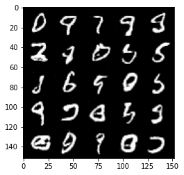

# Deep learning play
Playing around with deep-learning, machine-learning, etc.

# MNIST convolutional network

Files [mnist_conv.py](mnist_conv.py) or [minst_conv_0_01.ipynb](minst_conv_0_01.ipynb)

Reaches about 0.0086% error rate (99.9916% accuracy) using deep convolutional network.

# MNIST GAN

Files [mnist_gan.py](mnist_conv.py) or [mnist_gan.ipynb](minst_conv_0_01.ipynb)

Generates MNIST dataset using General Adversarial Network (GAN)

